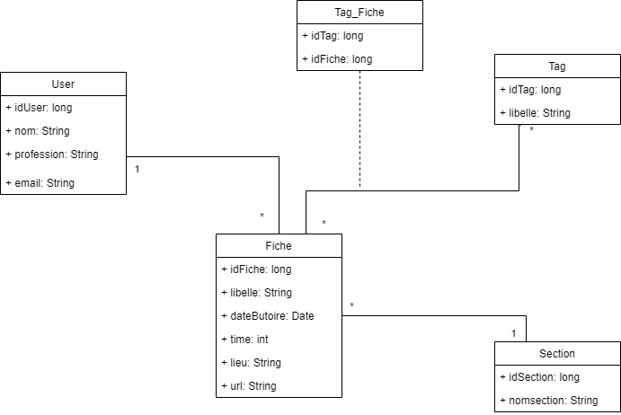
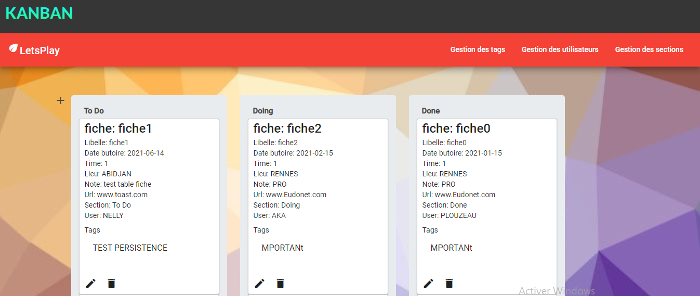

## Kanban
The TP 10 allows us to build from our Angular skills a web interface for our application
developed in Java on the server side.

## Notable feature
The goal of the project is to be able to connect two applications front-end( Angular)
and back-end( JPA + JaxRS) via REST APIs.

## Design - Data
We designed our database using this model

##  Getting Started
<li>create a myqsl database named <strong>tpdatabase</strong>
<li>clone the back-end: <strong>https://github.com/mauriceaka/JaxRSOpenAPI.git</strong>
<li>run the back-end.
<li>clone the front-end:<strong>https://github.com/morningxtar/kanban.git</strong> 
<li>run the front-end ( npm start )

## Design - Angular App
for an empty database, the section and user tables must be populated as they are mandatory fields in the creation of a record.
To do this, go to:
<li>section management for the sections
<li>user management for the users.
To return to the kanban-board, click on the <strong>KANBAN</strong>.
We have the possibility to:
<li>drag and drop a form in a section (this modifies the section when it is operated)
<li>edit a card
<li>delete a card
<li>create a record (+ icon)
PS: For the tabs in the navbar, you also have the possibility to edit, delete and create.

## areas for improvement
<li>updating the page (often) to validate an action taken
<li>When creating or editing a record, the tag value is not updated in the database
<li>When editing a record, the section, the tag and the user of the record are not displayed, although they are present.
When deleting a section or a user, you must <strong>delete the records containing this section or this user </strong>.

## Built With
<li>bulma is a framework that provides ready-made front-end components that you can easily combine to create responsive web interfaces.
<li>Angular material is a library of user interface components for Angular JS developers
<li>Angular is a JavaScript framework for creating web applications, especially single page applications
<li>Jersey : jersey is a framework that allows you to develop web services according to the REST architecture following the specifications of JAX-RS.
<li>Maven is a tool for managing and automating the production of software projects

## Authors
This project was developed by these students: 
• Rebecca EHUA

• Maurice AKA

• Franck KOUAMELAN

note that this work would not be done without having forked the project that our teacher gave us, sir Olivier BARAIS.
Thanks for your help and your time!!!
